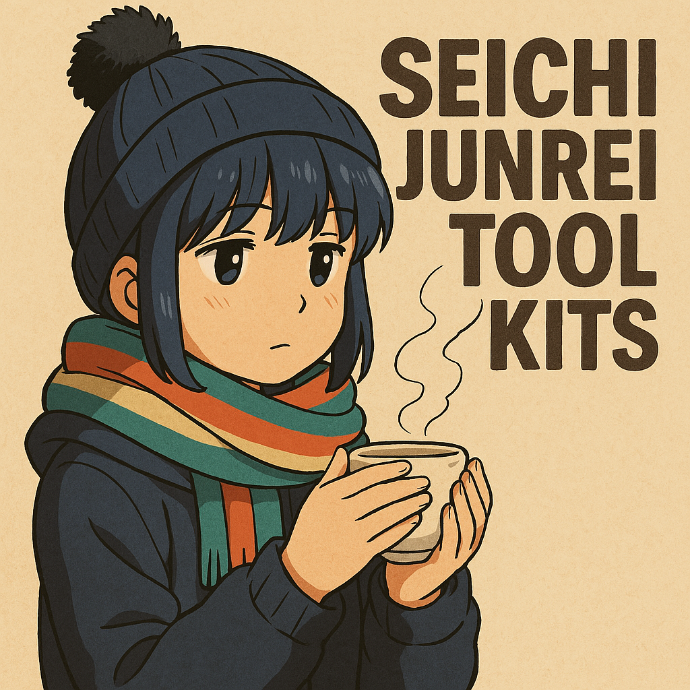
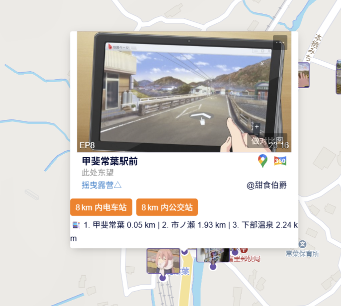
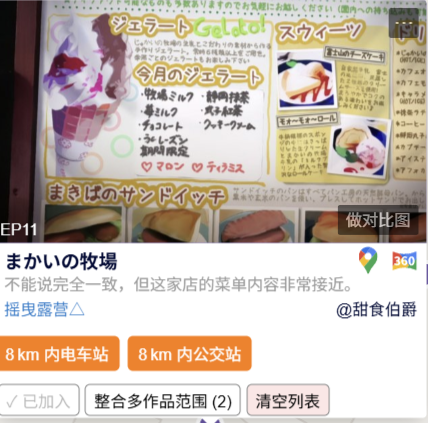
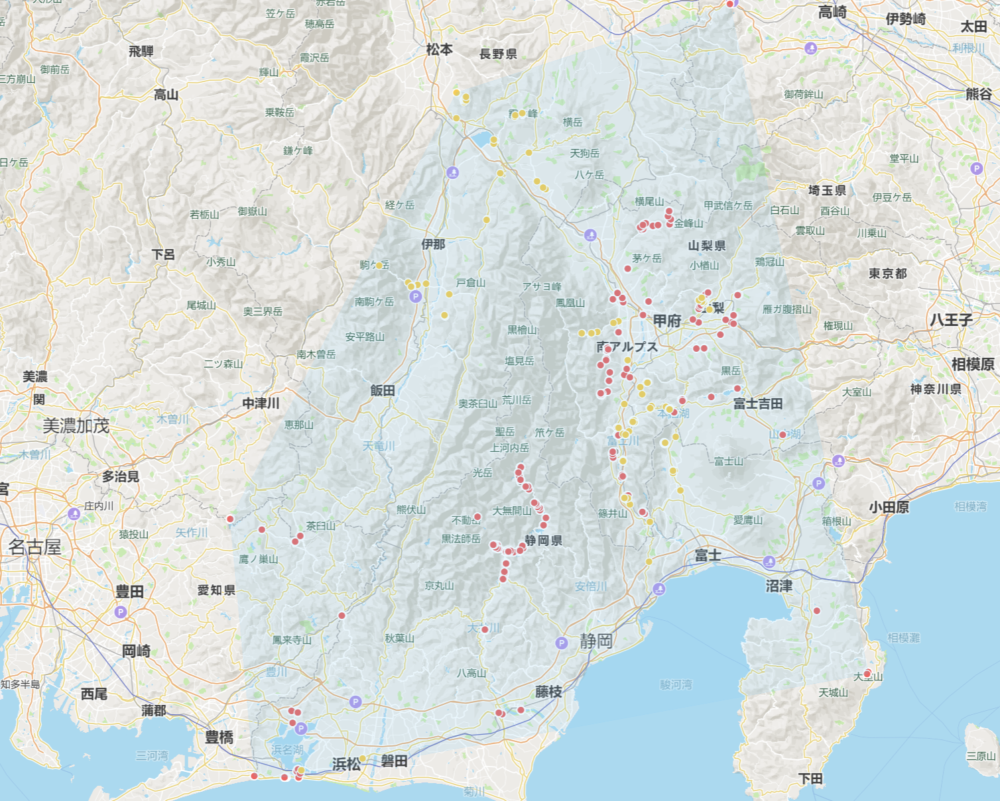

# anitabi-tampermonkey-scripts
The scripts for Anitabi landmarks
用于[Anitabi](https://anitabi.cn/map)的一些自用脚本。

| Script Name | Description  |
|-----------------------------------------------------------------------|-----------------------------------------------------------------------|
|[eki-finder-by-dom.user.js](https://github.com/Arthurzyang/anitabi-customised-scripts/blob/main/eki-finder-by-dom.user.js)|[圣地巡礼车站搜寻器](https://github.com/Arthurzyang/seichijunrei-eki-finder-py3)的油猴版本的改进版本，直接将功能嵌入到Anitabi的小卡片上，搜寻8公里内前三近的电车站/公交站。|
|[eki-finder-by-url-original version.user.js](https://github.com/Arthurzyang/anitabi-customised-scripts/blob/main/eki-finder-by-url-original%20version.user.js)|[圣地巡礼车站搜寻器](https://github.com/Arthurzyang/seichijunrei-eki-finder-py3)的油猴版本的原始版本，坐标抓取逻辑和dom版不同。|
|[multi-anime-integration.user.js](https://github.com/Arthurzyang/anitabi-customised-scripts/blob/main/multi-anime-integration.user.js)|将多个作品添加到列表后，整合为新的坐标过滤条件。此脚本暂时只是能用的状态，需要进一步改善。|

## eki-finder-by-dom.user.js

简单来说，这个脚本就是在每个地标的小卡片底部增加了两个按钮，分别寻找该地标半径8km内前三近的电车/巴士站。

||点击后，会在卡片下方自适应一个基于Overpass APIs返回的查询结果。此脚本需要放开油猴扩展对Overpass APIs的收发请求。[eki-finder-by-url-original version.user.js](https://github.com/Arthurzyang/anitabi-customised-scripts/blob/main/eki-finder-by-url-original%20version.user.js)是一个更加原始的版本，但它的客制化空间更大。|
|-----------------------------------------------------------------------|-----------------------------------------------------------------------|

## multi-anime-integration.user.js

多作品整合都快成Anitabi issues的日经贴了。可以先用这个脚本平替一下。你需要先在目标作品下的任意地标小卡片中将这个作品加入到整合列表中，然后点击“整合多作品范围”，就可以在地图上重新生成一个基于整合作品的地标筛选与范围划定。
这个脚本目前只做了筛选和范围划定，至于左侧地标列表有空再搞。

||点击小卡片左下角的按钮将作品加入到整合列表中|
|-----------------------------------------------------------------------|-----------------------------------------------------------------------|
||**这里将摇曳露营第一季和第三季同时整合，可以看到大地图上现在只有S01和S03的标点，并重新划定了巡礼范围。**|

